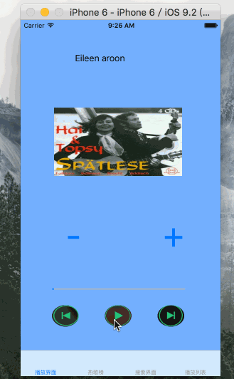

#考核总结

* 首先就是自己最后心态爆炸，被bug搞的一套糊涂，**未按时上交**，需要反思。
* 完成了大体的内容，但是bug还是一堆。
* 只支持下载后播放，一次只能下载一首歌。

##热门榜单

1. 完成了列表呈现。
2. 由于坑爹的API，一些内容不一定会呈现。
3. 可以通过点击内容进行下载。

##查询界面

1. 界面上显示不完全 (API无数据)。
2. 暂未完成分页加载。
3. 下载一些歌曲可能会爆炸（特别是无名歌曲）。

##播放界面
1. UI难看的一塌糊涂。
2. 播放列表暂时不支持点击听歌(已支持)。
3. 数据写入本地，但暂时未考虑删除，下太多小心硬盘爆炸。

##歌曲播放
1. 只支持下载后播放。
2. 流媒体什么的完全不会。
3. 一些歌曲下载后无法播放（暂未找到原因）。
4. 下载完成后播放会停止，并回到第一首歌（正在修复...）。

## 后台播放
1. 未完成，连前面都没完成，后面的就更不会了（泪！）

## 其他
* 代码和屎一样，凑合着看吧。
* 借助考核还是学到了很多，不管能不能通过，还是很感激这次机会。

